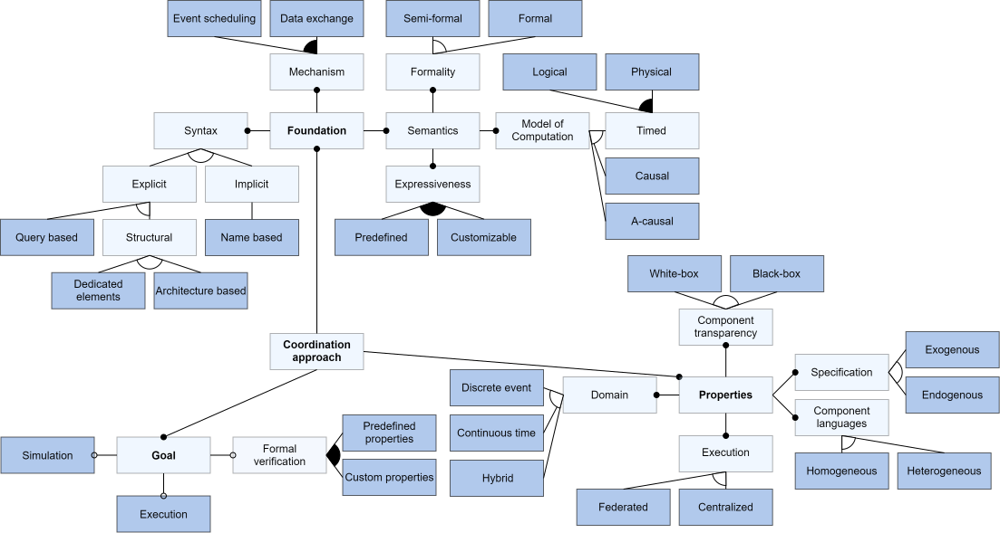

# Methodology
The following queries were used for the **tertiary study**. You can click on **Google Scholar** or **Scopus** to run the queries for the respective databases.
The study considered the first five pages of Google Scholar (5 * 10) and all Scopus results.

## Coordination language query
```
(survey OR taxonomy OR review OR overview OR state of the art OR framework) AND coordination language
```

### [Google Scholar](https://scholar.google.com/scholar?start=0&q=survey+OR+taxonomy+OR+review+OR+overview+OR+state+of+the+art+OR+framework+%22coordination+language%22&hl=en&as_sdt=0,5)

The query leads to over 4.800 results. We only investigated the first five pages, i.e., 50 results (see [./meta-analysis/google_scholar_CL.pdf](./meta-analysis/google_scholar_CL.pdf)).
6 of the results were used in the thesis (P1: 3, P2: 0, P3: 2, P4: 0, P5: 1).

### Scopus

The query gives 49 results (see [./meta-analysis/scopus_CL.csv](./meta-analysis/scopus_CL.csv)).
3 of the results were used in the thesis (2 of them are papers from the proceedings of the Coordination conference).

```
(TITLE-ABS("survey") OR TITLE-ABS("taxonomy") OR TITLE-ABS("review") OR TITLE-ABS("overview") OR TITLE-ABS("state of the art") OR TITLE("framework")) AND TITLE-ABS("coordination language") AND ( LIMIT-TO ( SUBJAREA,"COMP" ) )
```

[Query with HVL proxy](https://www-scopus-com.galanga.hvl.no/results/results.uri?sort=plf-f&src=s&sid=cc73494d8739af920ef68944cd4134f1&sot=a&sdt=a&cluster=scosubjabbr%2C%22COMP%22%2Ct&sl=188&s=%28TITLE-ABS%28%22survey%22%29+OR+TITLE-ABS%28%22taxonomy%22%29+OR+TITLE-ABS%28%22review%22%29+OR+TITLE-ABS%28%22overview%22%29+OR+TITLE-ABS%28%22state+of+the+art%22%29+OR+TITLE%28%22framework%22%29%29+AND+TITLE-ABS%28%22coordination+language%22%29&origin=savedSearchNewOnly&txGid=442c85086ba0b279bcd3380448b15bca&sessionSearchId=cc73494d8739af920ef68944cd4134f1&limit=50).


## ADL query
```
(survey OR taxonomy OR review OR overview OR state of the art OR framework) AND architecture description language
```

### [Google Scholar](https://scholar.google.com/scholar?start=0&q=survey+OR+taxonomy+OR+review+OR+overview+OR+state+of+the+art+OR+framework+%22architecture+description+language%22&hl=en&as_sdt=0,5)

The query leads to over 7.000 results. We only investigated the first five pages, i.e., 50 results (see [./meta-analysis/google_scholar_ADL.pdf](./meta-analysis/google_scholar_ADL.pdf)).
7 of the results were used in the thesis (P1: 3, P2: 2, P3: 2, P4: 0, P5: 0).

### Scopus

The query gives 17 results (see [./meta-analysis/scopus_ADL.csv](./meta-analysis/scopus_ADL.csv)).
5 of the results were used in the thesis.

```
(TITLE-ABS("survey") OR TITLE-ABS("taxonomy") OR TITLE-ABS("review") OR TITLE-ABS("overview") OR TITLE-ABS("state of the art") OR TITLE("framework")) AND TITLE("architecture description language") AND ( LIMIT-TO ( SUBJAREA,"COMP" ) )
```

[Query with HVL proxy](https://www-scopus-com.galanga.hvl.no/results/results.uri?sort=plf-f&src=s&sid=4a84c255ef8889b6e9101bc3a10c15bf&sot=a&sdt=a&cluster=scosubjabbr%2C%22COMP%22%2Ct&sl=196&s=%28TITLE-ABS%28%22survey%22%29+OR+TITLE-ABS%28%22taxonomy%22%29+OR+TITLE-ABS%28%22review%22%29+OR+TITLE-ABS%28%22overview%22%29+OR+TITLE-ABS%28%22state+of+the+art%22%29+OR+TITLE%28%22framework%22%29%29+AND+TITLE%28%22architecture+description+language%22%29&origin=searchadvanced&editSaveSearch=&txGid=d953b1bb82193bd714c410ac65ddf6ba&sessionSearchId=4a84c255ef8889b6e9101bc3a10c15bf&limit=20).

## Co-simulation query
```
(survey OR taxonomy OR review OR overview OR state of the art) AND (co-simulation OR co simulation)
```

### [Google Scholar](https://scholar.google.com/scholar?hl=en&as_sdt=0%2C5&q=%28survey+OR+taxonomy+OR+review+OR+overview+OR+state+of+the+art%29+%28%22co-simulation%22+OR+%22co+simulation%22%29&btnG=)

The query leads to over 17.000 results. We only investigated the first five pages, i.e., 50 results (see [./meta-analysis/google_scholar_COSIM.pdf](./meta-analysis/google_scholar_COSIM.pdf)).
5 of the results were used in the thesis (P1: 4, P2: 1, P3: 0, P4: 0, P5: 0).

### Scopus

The query gives 78 results (see [./meta-analysis/scopus_COSIM.csv](./meta-analysis/scopus_COSIM.csv)).
4 of the results were used in the thesis.

```
(TITLE-ABS("survey") OR TITLE-ABS("taxonomy") OR TITLE-ABS("review") OR TITLE-ABS("overview") OR TITLE-ABS("state of the art")) AND TITLE("co-simulation") AND ( LIMIT-TO ( SUBJAREA,"COMP" ) )
```

[Query with HVL proxy](https://www-scopus-com.galanga.hvl.no/results/results.uri?sort=plf-f&src=s&sid=b65107e740ca1f7cf1751d810c990070&sot=a&sdt=a&cluster=scosubjabbr%2C%22COMP%22%2Ct&sl=154&s=%28TITLE-ABS%28%22survey%22%29+OR+TITLE-ABS%28%22taxonomy%22%29+OR+TITLE-ABS%28%22review%22%29+OR+TITLE-ABS%28%22overview%22%29+OR+TITLE-ABS%28%22state+of+the+art%22%29%29+AND+TITLE%28%22co-simulation%22%29&origin=resultslist&editSaveSearch=&txGid=c42392e9bb5ace66b6fa9b9ecfede1fa&sessionSearchId=b65107e740ca1f7cf1751d810c990070&limit=100).

# Feature model
The following figure shows the complete feature model.



# Artifacts
The artifacts are described [here](./artifacts/python-scripts/README.md).
They contain all [data](./artifacts/classification.xlsx) from applying the feature model to the different approaches.
In addition, the analysis scripts to do the approach clustering and generate related diagrams are provided.
