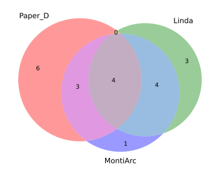
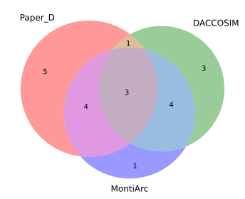
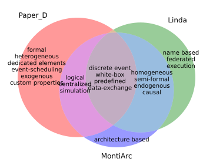
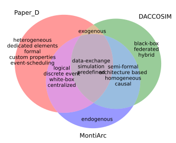
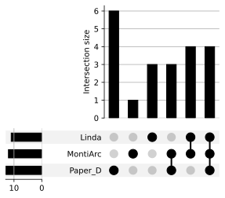
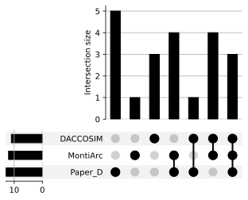
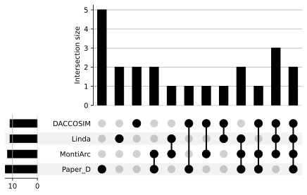
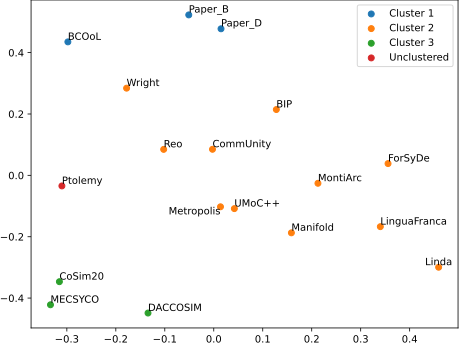

# Artifacts Chapter 3

This file describes the scripts used in chapter 3 of the thesis.

# Data

The data from applying the feature model to the different approaches can be found in tabular
format [here](.././classification.xlsx).

The scripts used in our analysis and described below **rely on this file** to read features for the diagrams and
calculate feature [distances](./distance/distances.xlsx) for the clustering.
If the data file is changed to include a new approach, one has to regenerate the precomputed distances.

# Analysing the data and generating visualizations

Follow these steps to run the analysis on your machine.

1. Clone this repository.
2. Open a terminal in this folder.
3. Install [Python](https://www.python.org/downloads/) and the required packages using
   `pip install -r requirements.txt`.
4. Run one of the following commands.

`python` is used to refer to the installed Python CLI in all the commands.
Users with linux/macOS machines might have to substitute `python` with `python3` depending on their installation.

## Venn Diagram: Paper_D Linda MontiArc

```bash
python Generate_Venn.py Paper_D Linda MontiArc
```

Generates the **first Venn diagram** in the paper:



Venn diagrams with feature labels can be obtained, as described in the next section.

## Venn Diagram: Paper_D DACCOSIM MontiArc

```bash
python Generate_Venn.py Paper_D DACCOSIM MontiArc
```

Generates the **second Venn diagram** in the paper:



Venn diagrams with feature labels can be obtained, as described in the next section.

## Venn Diagrams with feature labels

To obtain Venn diagrams with feature labels, follow the same procedure as before but use one of the commands below:

### Venn Diagram: Paper_D Linda MontiArc

**Script:**

```bash
python Generate_Venn_With_Labels.py Paper_D Linda MontiArc
```

**Output:**



### Venn Diagram: Paper_D DACCOSIM MontiArc

**Script:**

```bash
python Generate_Venn_With_Labels.py Paper_D DACCOSIM MontiArc
```

**Output:**



## Equivalent UpSet plots

More information about [UpSet plots](https://upset.app/)
Follow the same procedure as before, but use one of the new commands below to generate UpSet plots:

### UpSet plot: Paper_D Linda MontiArc

**Script:**

```bash
python Generate_Upset.py Paper_D Linda MontiArc
```

**Output:**



### UpSet plot: Paper_D DACCOSIM MontiArc

**Script:**

```bash
python Generate_Upset.py Paper_D DACCOSIM MontiArc
```

**Output:**



### UpSet plot: Custom approaches

UpSet plots make the most sense for more than three approaches.
You can add as many approaches and arguments as you want.

**Script:**

```bash
python Generate_Upset.py Paper_D Linda MontiArc DACCOSIM
```

**Output:**



## Clustering

We clustered the approaches using the [DBSCAN](https://en.wikipedia.org/wiki/DBSCAN) algorithm with
the [Jaccard distance](https://en.wikipedia.org/wiki/Jaccard_index#Overview) metric.
You can find a table with the calculated distances later.

**Parameters:**

- Number of minimum samples in a cluster = two (`min_samples=2`)
- Maximum distance between two samples to be considered neighbors (`eps=0.34`).
- Precomputed distance metric is given by the Jaccard_distance (`metric='precomputed'`)

### Clustering results

The results of the clustering are the following:

```
Number of clusters: 3
Number of not clustered points: 1
Clusters:
0: {'BCOoL', 'Paper_D', 'Paper_B'}
1: {'CommUnity', 'UMoC++', 'ForSyDe', 'Manifold', 'Wright', 'MontiArc', 'LinguaFranca', 'BIP', 'Reo', 'Linda', 'Metropolis'}
2: {'DACCOSIM', 'CoSim20', 'MECSYCO'}
Not clustered: {'Ptolemy'}
```

You can run the following script to reproduce the results:

```bash
python Cluster_approaches.py
```

The distance matrix, together with the clustering, is visualized in the following scatter plot (
see `Scatter_approachey_by_distance.py`):



The plot approximates the position of each approach relative to the others by using the distance matrix.
It cannot be exact, but it paints a good overall picture.

### Jaccard distance matrix (clustering input)

For the table, which shows the **Jaccard distance** between the feature sets (see `./distance/distances.xlsx`).
This data is the precomputed input for the clustering (see `Calculate_distance_matrix.py`).

|              |   Paper_B |   Paper_D |    BCOoL |  Ptolemy |   Wright | MontiArc | CommUnity | Metropolis |  MECSYCO | DACCOSIM |  CoSim20 |    UMoC++ | LinguaFranca |      Reo |    Linda |      BIP | Manifold |  ForSyDe |
|:-------------|----------:|----------:|---------:|---------:|---------:|---------:|----------:|-----------:|---------:|---------:|---------:|----------:|-------------:|---------:|---------:|---------:|---------:|---------:|
| Paper_B      |         0 | 0.0769231 | 0.285714 | 0.555556 | 0.529412 | 0.666667 |       0.5 |   0.588235 |      0.8 |     0.85 | 0.736842 |  0.647059 |     0.761905 | 0.611111 |     0.85 |      0.5 | 0.722222 |      0.7 |
| Paper_D      | 0.0769231 |         0 | 0.333333 |      0.5 | 0.555556 | 0.611111 |  0.529412 |   0.529412 |     0.75 |      0.8 | 0.684211 |  0.588235 |     0.714286 | 0.555556 |      0.8 | 0.444444 | 0.666667 |     0.65 |
| BCOoL        |  0.285714 |  0.333333 |        0 | 0.555556 |   0.4375 | 0.666667 |       0.5 |   0.666667 |      0.8 |     0.85 | 0.736842 |  0.647059 |     0.761905 | 0.529412 |     0.85 |      0.5 | 0.722222 |      0.7 |
| Ptolemy      |  0.555556 |       0.5 | 0.555556 |        0 | 0.578947 | 0.470588 |     0.375 |   0.470588 | 0.470588 | 0.529412 |    0.375 |    0.4375 |     0.526316 | 0.411765 |     0.75 | 0.473684 | 0.529412 | 0.444444 |
| Wright       |  0.529412 |  0.555556 |   0.4375 | 0.578947 |        0 | 0.529412 |  0.333333 |   0.529412 | 0.809524 | 0.736842 |     0.75 |       0.5 |         0.65 | 0.266667 |      0.8 |     0.25 | 0.588235 | 0.578947 |
| MontiArc     |  0.666667 |  0.611111 | 0.666667 | 0.470588 | 0.529412 |        0 |  0.285714 |   0.285714 | 0.666667 |   0.5625 | 0.588235 |  0.230769 |     0.266667 | 0.333333 | 0.466667 | 0.411765 | 0.357143 | 0.266667 |
| CommUnity    |       0.5 |  0.529412 |      0.5 |    0.375 | 0.333333 | 0.285714 |         0 |   0.285714 | 0.666667 |   0.5625 | 0.588235 |  0.230769 |     0.470588 | 0.214286 | 0.647059 |   0.3125 | 0.357143 |    0.375 |
| Metropolis   |  0.588235 |  0.529412 | 0.666667 | 0.470588 | 0.529412 | 0.285714 |  0.285714 |          0 | 0.588235 | 0.466667 | 0.588235 | 0.0833333 |     0.470588 | 0.333333 |   0.5625 | 0.411765 | 0.230769 | 0.470588 |
| MECSYCO      |       0.8 |      0.75 |      0.8 | 0.470588 | 0.809524 | 0.666667 |  0.666667 |   0.588235 |        0 | 0.230769 | 0.153846 |    0.5625 |     0.631579 | 0.684211 | 0.722222 | 0.714286 | 0.647059 | 0.761905 |
| DACCOSIM     |      0.85 |       0.8 |     0.85 | 0.529412 | 0.736842 |   0.5625 |    0.5625 |   0.466667 | 0.230769 |        0 | 0.230769 |  0.428571 |     0.529412 | 0.588235 |    0.625 | 0.631579 | 0.533333 | 0.684211 |
| CoSim20      |  0.736842 |  0.684211 | 0.736842 |    0.375 |     0.75 | 0.588235 |  0.588235 |   0.588235 | 0.153846 | 0.230769 |        0 |    0.5625 |     0.555556 | 0.611111 | 0.722222 |     0.65 | 0.647059 |      0.7 |
| UMoC++       |  0.647059 |  0.588235 | 0.647059 |   0.4375 |      0.5 | 0.230769 |  0.230769 |  0.0833333 |   0.5625 | 0.428571 |   0.5625 |         0 |       0.4375 | 0.285714 | 0.533333 |    0.375 | 0.166667 |   0.4375 |
| LinguaFranca |  0.761905 |  0.714286 | 0.761905 | 0.526316 |     0.65 | 0.266667 |  0.470588 |   0.470588 | 0.631579 | 0.529412 | 0.555556 |    0.4375 |            0 |      0.5 | 0.333333 | 0.473684 |   0.4375 |     0.25 |
| Reo          |  0.611111 |  0.555556 | 0.529412 | 0.411765 | 0.266667 | 0.333333 |  0.214286 |   0.333333 | 0.684211 | 0.588235 | 0.611111 |  0.285714 |          0.5 |        0 | 0.666667 | 0.352941 |      0.4 | 0.411765 |
| Linda        |      0.85 |       0.8 |     0.85 |     0.75 |      0.8 | 0.466667 |  0.647059 |     0.5625 | 0.722222 |    0.625 | 0.722222 |  0.533333 |     0.333333 | 0.666667 |        0 | 0.631579 | 0.428571 |   0.4375 |
| BIP          |       0.5 |  0.444444 |      0.5 | 0.473684 |     0.25 | 0.411765 |    0.3125 |   0.411765 | 0.714286 | 0.631579 |     0.65 |     0.375 |     0.473684 | 0.352941 | 0.631579 |        0 |    0.375 | 0.388889 |
| Manifold     |  0.722222 |  0.666667 | 0.722222 | 0.529412 | 0.588235 | 0.357143 |  0.357143 |   0.230769 | 0.647059 | 0.533333 | 0.647059 |  0.166667 |       0.4375 |      0.4 | 0.428571 |    0.375 |        0 | 0.333333 |
| ForSyDe      |       0.7 |      0.65 |      0.7 | 0.444444 | 0.578947 | 0.266667 |     0.375 |   0.470588 | 0.761905 | 0.684211 |      0.7 |    0.4375 |         0.25 | 0.411765 |   0.4375 | 0.388889 | 0.333333 |        0 |
